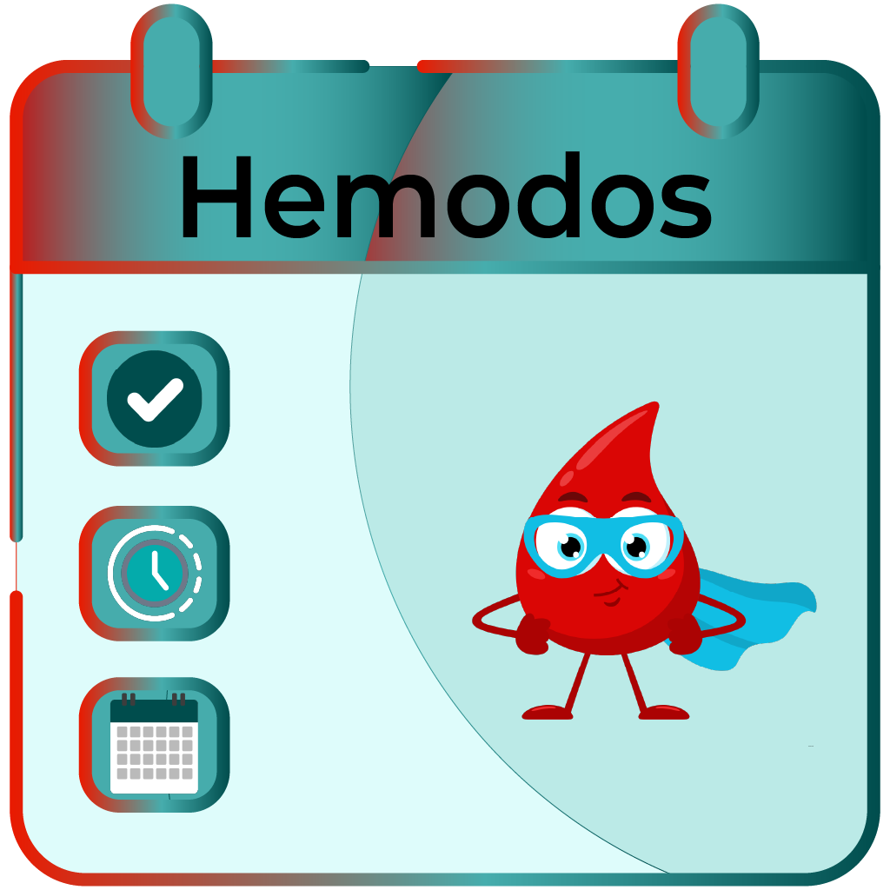

# 🩸 Hemodos - Gestione Donazioni di Sangue | Blood Donation Management

🇮🇹 Hemodos è un'applicazione desktop sviluppata da [Emmanuele Pani](https://github.com/emmanueleP) per la gestione e l'organizzazione delle prenotazioni per le donazioni di sangue.

🇬🇧 Hemodos is a desktop application developed by [Emmanuele Pani](https://github.com/emmanueleP) for managing and organizing blood donation appointments.

## 📥 Download

🇮🇹 Scarica l'ultima versione:
- [Hemodos v1.0.5](https://github.com/emmanueleP/hemodos/releases/tag/v1.0.5) (Windows)

🇬🇧 Download the latest version:
- [Hemodos v1.0.5](https://github.com/emmanueleP/hemodos/releases/tag/v1.0.5) (Windows)

## ✨ Caratteristiche Principali | Main Features

🇮🇹
- 📅 Gestione calendario donazioni con evidenziazione delle date
- ⏰ Prenotazioni per fasce orarie (7:50 - 12:10)
- 🆕 Gestione automatica prime donazioni (disabilitate dopo le 10:00)
- ✅ Tracciamento stato donazioni (effettuata, non effettuata, ecc.)
- ☁️ Supporto per salvataggio su cloud (OneDrive, Google Drive)
- 💾 Salvataggio automatico configurabile
- 📄 Esportazione dati in formato DOCX
- 🖨️ Stampa documenti con layout personalizzato
- 🖼️ Possibilità di aggiungere logo personalizzato
- 📊 Statistiche mensili, trimestrali e annuali
- 🎨 Temi chiaro e scuro

🇬🇧
- 📅 Donation calendar management with date highlighting
- ⏰ Time slot bookings (7:50 AM - 12:10 PM)
- 🆕 Automatic first-time donor management (disabled after 10:00 AM)
- ✅ Donation status tracking (completed, not completed, etc.)
- ☁️ Cloud storage support (OneDrive, Google Drive)
- 💾 Configurable automatic saving
- 📄 Data export in DOCX format
- 🖨️ Document printing with custom layout
- 🖼️ Custom logo support
- 📊 Monthly, quarterly, and yearly statistics
- 🎨 Light and dark themes

## 💻 Requisiti di Sistema | System Requirements

🇮🇹
- Sistema operativo: Windows, macOS, Linux
- Python 3.6 o superiore
- Librerie richieste:
  - PyQt5
  - python-docx
  - matplotlib
  - watchdog

🇬🇧
- Operating System: Windows, macOS, Linux
- Python 3.6 or higher
- Required libraries:
  - PyQt5
  - python-docx
  - matplotlib
  - watchdog

## 🚀 Installazione | Installation

🇮🇹
1. Scarica l'ultima versione dell'installer
2. Esegui l'installer e segui le istruzioni
3. Avvia Hemodos dal menu Start o dall'icona sul desktop

🇬🇧
1. Download the latest installer version
2. Run the installer and follow the instructions
3. Launch Hemodos from Start menu or desktop icon

## ⚙️ Configurazione | Configuration

🇮🇹
Al primo avvio, l'applicazione chiederà di:
1. Scegliere la modalità di salvataggio (locale o cloud)
2. Configurare il percorso del database
3. Impostare le preferenze di base

🇬🇧
On first launch, the application will ask to:
1. Choose storage mode (local or cloud)
2. Configure database path
3. Set basic preferences

## 📖 Utilizzo | Usage

🇮🇹
- Usa il calendario per navigare tra le date
- Aggiungi/modifica prenotazioni nella tabella
- Gestisci gli stati delle donazioni
- Esporta o stampa i dati quando necessario
- Visualizza le statistiche per monitorare l'andamento

🇬🇧
- Use the calendar to navigate between dates
- Add/modify appointments in the table
- Manage donation statuses
- Export or print data when needed
- View statistics to monitor progress

## 🆘 Supporto | Support

🇮🇹
Per segnalare bug o richiedere nuove funzionalità, apri una issue su GitHub.

🇬🇧
To report bugs or request new features, open an issue on GitHub.

## 📄 Licenza | License

🇮🇹
Questo progetto è rilasciato sotto licenza MIT. Vedi il file [LICENSE.md](LICENSE.md) per i dettagli.

🇬🇧
This project is released under the MIT license. See [LICENSE.md](LICENSE.md) file for details.

## 👨‍💻 Autore | Author

Emmanuele Pani - [GitHub](https://github.com/emmanueleP)
